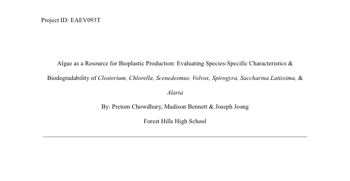
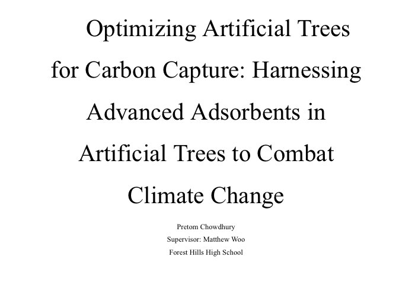

# Independent Research

Research projects I did at Forest Hills High School in Queens, NY. Each one was supervised, but the experimental design, the lab work and the writing were done by me or by me and my lab partners. The full papers are in this repo.

| Project | Field | Team | Recognition | Paper |
| --- | --- | --- | --- | --- |
| [Algae-based bioplastics](bioplastics/) | Environmental science, materials | Pretom Chowdhury, Madison Bennett, Joseph Jeong | NYC Science Fair (TERRA) 1st place, Environmental Sciences; Regeneron ISEF 4th place, Environmental Sciences; NOAA recognition at ISEF | [PDF, 31 pp.](bioplastics/algae-bioplastics-paper.pdf) |
| [Artificial trees for carbon capture](carbon-capture/) | Environmental science, chemistry | Pretom Chowdhury (supervisor: Matthew Woo) | New York State Science Fair winner | [PDF, 30 pp.](carbon-capture/artificial-trees-carbon-capture-paper.pdf) |

---

## 1. Algae as a Resource for Bioplastic Production

<a href="bioplastics/algae-bioplastics-paper.pdf"></a>

This was my first research project. We grew five species of green algae (*Closterium*, *Chlorella*, *Scenedesmus*, *Volvox*, *Spirogyra*) under controlled light, temperature and nutrients, then harvested the biomass by flocculation. We also made plastics from two brown algae, sugar kelp (*Saccharina latissima*) and *Alaria esculenta*, by mixing the dried seaweed with water, glycerol and cornstarch. We measured melting point, tensile strength and biodegradation rate for every sample.

**Result:** sugar kelp made the best plastic, with the highest tensile strength (0.60 MPa), the fastest biodegradation (1.21% of mass per day) and the lowest melting point (65 °C). We put this down to the high alginate content of brown seaweed, which helps it form flexible, clear films.

The project took 1st place in Environmental Sciences at the NYC Science Fair (TERRA) and qualified for Regeneron ISEF. At ISEF it placed 4th in Environmental Sciences and received recognition from NOAA.

[Full summary and data →](bioplastics/)

---

## 2. Optimizing Artificial Trees for Carbon Capture

<a href="carbon-capture/artificial-trees-carbon-capture-paper.pdf"></a>

My second project was entirely my own. Klaus S. Lackner's work on artificial trees made me wonder whether a small, cheap version could capture CO₂ in cities. I built the rig in my basement. I coated disks of silica gel, zeolite 13X and alumina with amine solutions (TEOA, MEA and a mix of the two), sealed them in an airtight chamber, pumped in CO₂ and logged the concentration with a CO₂ meter every hour for six hours. I ran four trials.

**Result:** every sorbent pulled CO₂ out of the chamber, and the amine coating mattered as much as the base material. The fastest first-hour captures were silica with the TEOA/MEA mix and zeolite with MEA. All of them saturated within a few hours, so the next step is to make the material last longer and to find a way to regenerate it. Each unit cost about $24 to build, which works out to roughly $300 per ton of CO₂ captured.

[Full summary and data →](carbon-capture/)

---

## What's next

I want to keep doing research under a professor, possibly in AI or in another field.

## Repository layout

```
.
├── bioplastics/
│   ├── README.md
│   └── algae-bioplastics-paper.pdf
├── carbon-capture/
│   ├── README.md
│   └── artificial-trees-carbon-capture-paper.pdf
└── assets/            # title-page previews used in this README
```
